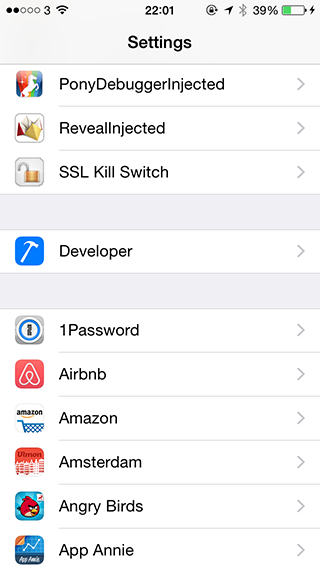
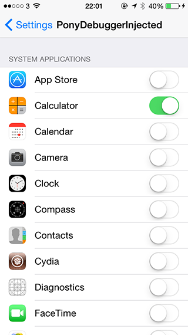
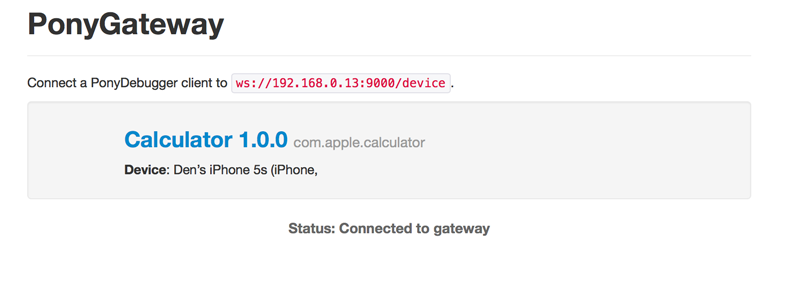

PonyDebuggerInjected
=====================

PonyDebugger is a great remote debugging toolset. It is a client library and gateway server combination that uses Chrome Developer Tools on your browser to debug your application's network traffic, view tree, core data objects, etc.

One of the limitations of PonyDebugger is that one must implement the client functionality in project's source code and connect it to the gateway server. But what if you wanted to use PonyDebugger to get a peek on how other applications are built, inspect view tree hierarchy, get access to runtime objects, Core Data entities, inspect networks calls, etc.

Here is where PonyDebuggerInjected comes in to play.

PonyDebuggerInjected is a MobileSubstrate extension, which can be used to inject PonyDebugger client library into running iOS Apps on a jailbroken iOS device. This allows one to use Chrome Developer Tools/PonyDebugger in your browser to inspect how applications are built, debug applications network traffic, managed object contexts, etc. For more info on PonyDebugger see https://github.com/square/PonyDebugger

Installation
------------

Most users should download the pre-compiled Debian package available under Releases.

### Dependencies

PonyDebugger Injected was tested on iOS 8.1, but it should work on other iOS versions too. A jailbroken device
is required. Using Cydia make sure the following packages are installed:
- dpkg
- MobileSubstrate
- PreferenceLoader

Additionally, PonyDebugger Gateway Server must be installed and running on the client machine (https://github.com/square/PonyDebugger/blob/master/README_ponyd.rst)

### How to install

Most users should first download the latest pre-compiled Debian package available in the release section of the project page at: https://github.com/dtrukr/PonyDebuggerInjected/releases

The tool was tested on iOS8 running on an iPhone 5S.

Download and copy the Debian package to the device; install it:  

    dpkg -i com.daapps.ponydebuggerinjected_0.0.1-1-2_iphoneos-arm.deb

Respring the device:

    killall -HUP SpringBoard

There should be a new menu in the device's Settings where you can
enable the extension:

Finally, start / restart the App you want to test and open PonyDebugger Server URL in your Chrome browser (http://localhost:9000 by default).

### How to uninstall

 dpkg -r com.daapps.ponydebuggerinjected

Build
-----

Most users should just download and install the Debian package.
The build requires the Theos suite to be installed;
see http://www.iphonedevwiki.net/index.php/Theos/Getting_Started .
You first have to create a symlink to your theos installation:

    ln -s /opt/theos/ theos

Make sure dpkg is installed. If you have Homebrew, use:

    brew install dpkg

Then, the package can be built using:

    make package
